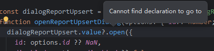
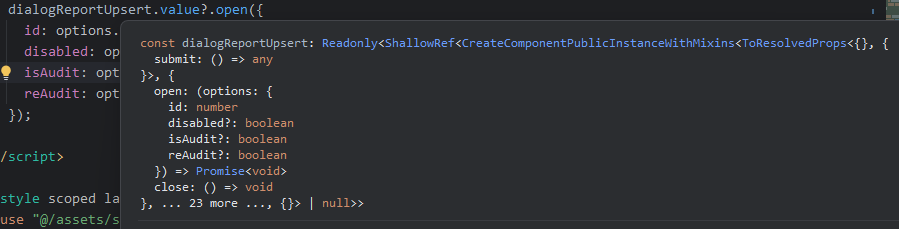
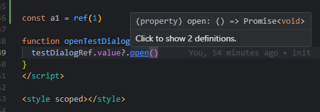

# [YouTrack WEB-73767](https://youtrack.jetbrains.com/tag/Star-473795?preview=WEB-73767)

This is a min reproduction of the issue with `useTemplateRef` in Vue 3.

### Problem:

No declaration found for vue component exposed function when using `useTemplateRef`. I cannot use <kbd>Ctrl</kbd> and **click** to go to the function declaration.

This operation runs well in VSCode with plugin `Vue - Official`.

